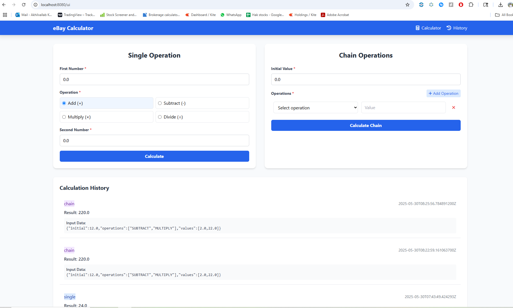

# eBay Calculator

A simple Spring Boot-based calculator app with UI and API support, Redis-backed history, and distributed tracing via Jaeger. Supports both local and production Docker environments.

---
# 



## ✅ Features

* **Single & chain calculations** (REST + Thymeleaf UI)
* **Parallel threaded calculations via API**
* Redis integration for storing calculation history
* OpenTelemetry tracing with Jaeger
* Docker & Docker Compose support for ***local and production***

---

## 🛠️ Tech Stack

* Java 17 (Eclipse Temurin)
* Spring Boot 3
* Redis
* Thymeleaf (UI)
* Docker + Docker Compose
* Jaeger (Tracing)
* OpenTelemetry API

---

## 🚀 How to Run

### 🔷 Local Setup (Dev)

> Run from `scripts/` directory

#### On Windows:

```bat
start-local.bat
```

#### On Mac/Linux:

```bash
./start-local.sh
```

### 🔷 Production Setup

> Uses `docker-compose.prod.yml` and `.env.prod`

#### On Windows:

```bat
start-prod.bat
```

#### On Mac/Linux:

```bash
./start-prod.sh
```

---
## ✅ Requirement Coverage

This project meets **all 7 + **1** key requirements**:

| # | Requirement              | Status | Description                                                                             |
|---|--------------------------| ------ |-----------------------------------------------------------------------------------------|
| 1 | Enum for operations      | ✅      | `Operation.java` defines `ADD`, `SUBTRACT`, `MULTIPLY`, `DIVIDE`                        |
| 2 | Basic calculation method | ✅      | `Calculator.calculate()` method handles single operations                               |
| 3 | Chaining operations      | ✅      | Supports sequential and threaded chains via `Calculator.chain` and `chainInParallel()`  |
| 4 | Extensibility            | ✅      | Uses `OperationStrategy` interface and Spring DI to add new operations                  |
| 5 | IoC compatibility        | ✅      | Follows Spring Boot IoC principles with `@Component` and `@Service`                     |
| 6 | Error handling           | ✅      | `GlobalExceptionHandler` handles known and unknown exceptions with custom JSON response |
| 7 | Testing                  | ✅      | Includes JUnit tests and comprehensive Postman test collection                          |
| 8 | thread support           | ✅      | Parrell processing of operations                                                        |

---
## 📦 Output

* App available at: [http://localhost:8080/ui](http://localhost:8080/ui)
* Jaeger UI: [http://localhost:16686](http://localhost:16686)
* Redis: port 6379 (via Docker)

---

## 🧪 Postman Tests

Import the full test suite covering all APIs and edge cases:
👉 [calculator\_api\_tests\_full.postman\_collection.json](https://github.com/koolkarni/calculator/blob/main/postman/calculator_api_tests_full.postman_collection.json)

---

## 🧼 Cleanup

```bash
docker compose down --volumes
```

Or for prod:

```bash
docker compose -f docker-compose.prod.yml down --volumes
```

---

## 🔮 Future Scope

* Add GraphQL controller to support more flexible queries
* Replace Thymeleaf UI with a modern React frontend
* Add Prometheus/Grafana for monitoring metrics
* Add AI for calculation suggestions or results
* Support JWT-based authentication for APIs

---

## 📝 License

MIT or your custom license
